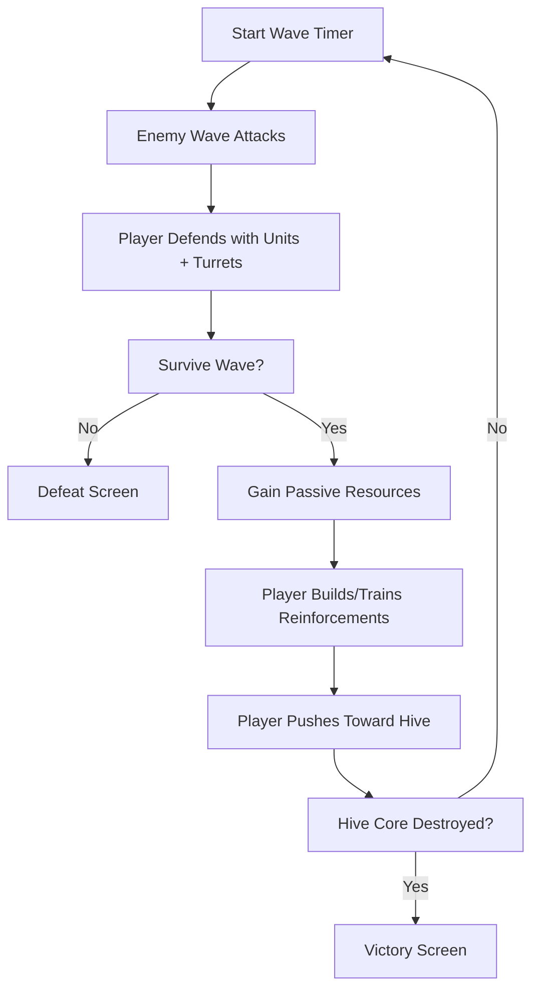

# Minimal Defensive RTS — “Hive Siege”

---

## Game Concept & Vision

**Elevator Pitch:** *Hive Siege* is a compact real-time strategy game where players build defenses, train a small army, and fight their way toward a fortified enemy Hive. The Hive constantly sends escalating waves of attackers, forcing the player to balance survival with gradual offense until the Hive Core is destroyed. Matches are short (10–20 minutes), tense, and focused on resource management and tactical positioning.

**Design Pillars:**

1. **Tension Through Pressure** – constant waves keep players under threat.
2. **Defensive Creativity** – players experiment with walls, turrets, and troop placement to hold out.
3. **Forward Momentum** – victory comes only by pushing into enemy territory.
4. **Simplicity & Clarity** – minimal systems, easy to learn, hard to master.

**Target Audience:** Strategy players who enjoy wave-defense games (e.g., *They Are Billions*), fans of classic RTS simplicity, and newcomers looking for a short-session RTS with clear rules and quick action.

---

## Core Gameplay Loop

**Loop Summary:**
Players defend their base against timed enemy waves while gathering resources and building up strength. With each wave survived, they reinforce defenses and prepare a counteroffensive. The ultimate goal is to break through the Hive’s defenses and destroy its core before being overrun.

**Primary Mechanics:**

* Building placement (walls, turrets, barracks)
* Unit training (soldiers)
* Resource management (single passive resource)
* Wave survival (enemy squads attack on timers)

**Secondary Systems:**

* Population cap limiting army size
* Escalating wave difficulty
* Simple rebuilding mechanic for the Hive’s defenses

---

## Core Loop Flowchart

---

## Player Experience

* **Early Game:** Scramble to set up initial defenses before the first waves.
* **Mid Game:** Struggle to balance holding the line with slowly advancing forward.
* **Late Game:** Final tense push into the Hive’s fortified zone, under constant wave pressure.

The fun comes from the rhythm of **defend → recover → push**, with constant tension and clear progress toward the goal.
